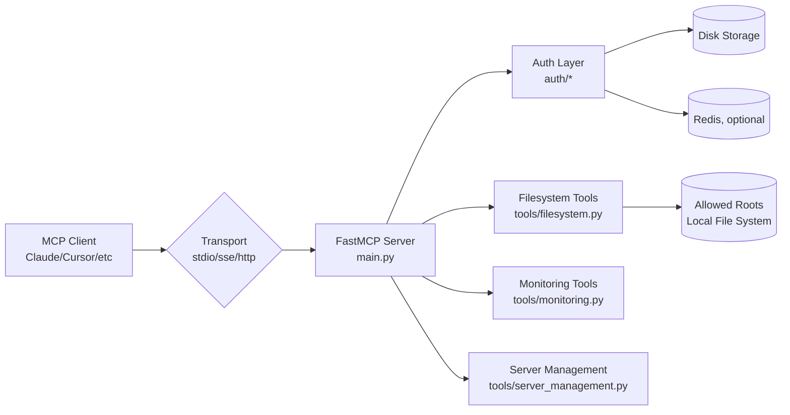

# MCP Filesystem Server

Сервер Model Context Protocol (MCP), який надає контрольований доступ до файлової системи, інструменти системного моніторингу та керування дозволеними root-директоріями.

## Архітектура та структурні елементи

Проєкт включає:
- **Application server:** Python + FastMCP (`main.py`) з інструментами файлової системи та моніторингу.
- **Web/server transport layer:** `stdio`, `sse` або `http` (налаштовується через `--transport`).
- **Файлове сховище:** локальна файлова система (операції читання/запису в межах `ALLOWED_ROOTS`).
- **Сервіс кешування (опційно):** Redis для persistent auth/session storage.
- **База даних:** не використовується в поточній архітектурі (стан зберігається в Disk/Redis storage).
- **Інші компоненти:** middleware для auth/access control, модулі логування, CI workflow.



## Вимоги до середовища

- Git
- Python 3.13+
- `pip` або `uv`
- (Опційно) Redis 7+ для persistent storage

## Швидкий старт

```
git clone https://github.com/LyaKonch/filesystem-mcp-server
cd filesystem-mcp-server

uv sync
# прослідкуйте щоб віртуальне середовище було активовано

python main.py --allow-cwd --no-auth
```

Без uv:
```bash
git clone <repository-url>
cd filesystem-mcp-server
python3 -m venv .venv
source .venv/bin/activate
python -m pip install --upgrade pip
pip install -e .
cp .env.example .env
# .env файл потрібно налаштувати під себе
python main.py --allow-cwd --no-auth --transport stdio
```

```powershell
git clone <repository-url>
cd filesystem-mcp-server
py -3.13 -m venv .venv
.\.venv\Scripts\Activate.ps1
python -m pip install --upgrade pip
pip install -e .
Copy-Item .env.example .env
# .env файл потрібно налаштувати під себе
python .\main.py --allow-cwd --no-auth --transport stdio
```

## Налаштування конфігурації

Основні параметри задаються як через `.env`:
- `MCP_HOST`, `MCP_PORT`, `TRANSPORT`
- `AUTH_ENABLED`
- `ALLOWED_ROOTS`
- `USE_PERSISTENT_STORAGE`, `USE_REDIS`, `REDIS_HOST`, `REDIS_PORT`
- `LOG_LEVEL`, `LOG_JSON`, `LOG_FILE`, `LOG_MAX_BYTES`, `LOG_BACKUP_COUNT`
- `ERROR_LOCALE` (`uk` або `en`) для локалізації користувацьких повідомлень про помилки
- `ERROR_REPORTS_FILE` (шлях до JSONL-файлу звітів про помилки від користувачів)
- `ALERT_WEBHOOK_URL`, `ALERT_WEBHOOK_TIMEOUT_SEC` (вебхук для оповіщень про `CRITICAL` помилки)


Так і через CLI прапорці:
| Аргумент | Опис |
| --- | --- |
| `roots` | Шляхи до дозволених директорій (наприклад `python --roots main.py /path/to/dir`). |
| `--allow-cwd` | Дозволити доступ до поточної робочої директорії. |
| `--no-auth` | Рекомендовано. Вимикає аутентифікацію (корисно, якщо виникають помилки з токенами). |
| `--transport` | Тип транспорту: `stdio` (за замовчуванням), `http` або `sse`. |
| `--host`, `--port` | Хост та порт для HTTP/SSE (за замовчуванням `127.0.0.1:8000`). |
| `--persist` | Зберігати стан сервера (дозволені клієнти) між перезапусками. |
| `--debug` | Увімкнути детальне логування для розробки. |
| `--log-level` | Мінімальний рівень логування: `DEBUG`, `INFO`, `WARNING`, `ERROR`, `CRITICAL`. |
| `--log-json` | Увімкнути JSON-формат логів (консоль + файл). |

## Логування та обробка помилок

- Логування налаштовано централізовано через `logging.config.dictConfig` (`utilities/logging.py`).
- Мінімальний рівень логування можна змінити без перекомпіляції через `.env` (`LOG_LEVEL`) або CLI (`--log-level`).
- Логи пишуться в:
  - `stdout` для `DEBUG/INFO`
  - `stderr` для `WARNING/ERROR/CRITICAL`
  - файл `LOG_FILE` через `RotatingFileHandler`
- Ротація логів: `LOG_MAX_BYTES` (макс. розмір файлу) + `LOG_BACKUP_COUNT` (кількість бекапів).
- Підтримується контекст логування: `request_id`, `user_id`, `operation`.
- Для необроблених винятків встановлено глобальні hooks (`sys.excepthook`, `threading.excepthook`) з `error_id` (UUID).
- Для критичних помилок сервера у `main.py` записується `error_id`, який можна дати користувачу для діагностики.
- Для tool-викликів помилки проходять через єдиний error-boundary: користувач отримує локалізоване повідомлення, `Error ID`, короткі кроки відновлення та підказку повідомити ID у підтримку.
- Для `CRITICAL` логів підтримано опційні webhook-оповіщення (якщо задано `ALERT_WEBHOOK_URL`).
- Додано механізм збору технічних даних від користувача через tool `submit_error_report` (summary, error_id, кроки відтворення, system info, attachments) зі збереженням у `ERROR_REPORTS_FILE`.

Для локальної розробки рекомендований режим:
- `--no-auth`
- `--allow-cwd`
- `--transport stdio`

Приклад команди для запуску в режимі http server:
```bash
python main.py --transport http --host 127.0.0.1 --port 8000 --persist
```
## Доступні інструменти (Tools)

### 📁 Розширена робота з файлами
- `list_files(path)` - Перегляд вмісту.
- `list_directory_with_sizes(path)` - Список файлів з їх розмірами.
- `read_file(path)` / `read_multiple_files(paths)` - Читання одного або кількох файлів.
- `write_file(path, content)` - Створення або перезапис файлу.
- `move_file(source, dest)` - Переміщення/перейменування.
- `delete_file(path, confirm)` - Видалення файлу. Вимагає підтвердження (`confirm=True` або через діалог з користувачем).
- `delete_directory(path, confirm)` - Рекурсивне видалення папки.
- `search_files(path, pattern)` - Пошук за glob-шаблонами.
- `filesystem_summary(path)` - Звіт про кількість файлів та загальний розмір.

### 🛡️ Аналіз та AI
- `analyze_directory_security(path)` - Сканує папку на підозрілі файли, дублі, великі файли та оцінює безпеку. Може використовувати AI для звіту.
- `get_creative_file_description(path)` - Використовує AI для опису вмісту файлу (якщо клієнт підтримує sampling).

### 📊 Моніторинг системи
- `get_system_resource_usage()` - Завантаження CPU та RAM у реальному часі.
- `get_disk_status()` - Інформація про вільне місце на всіх дисках.
- `get_system_info()` - Деталі про OS, аптайм, версію ядра та хостнейм.

### ⚙️ Керування сервером
- `get_server_status()` - Перевірка активного транспорту, features клієнта та поточних roots.
- `list_allowed_roots()` - Показати всі доступні папки.
- `add_allowed_root(path)` - Додати нову папку в білий список без перезапуску сервера.
- `remove_root(path)` - Забрати доступ до папки.
- `submit_error_report(summary, error_id?, reproduction_steps?, system_info?, attachments?)` - Надіслати технічний звіт про помилку для підтримки.

## Налаштування MCP Клієнта (Claude Desktop / Cursor)

### Рекомендована конфігурація (STDIO)

Найпростіший спосіб без проблем з портами та токенами.

```json
{
  "mcpServers": {
    "filesystem": {
      "command": "python",
      "args": [
        "absolute/path/to/main.py",
        "--allow-cwd",
        "--no-auth"
      ]
    }
  }
}
```

Не забудьте вказати повний шлях до python (наприклад `.venv/Scripts/python`), якщо використовуєте віртуальне середовище.

### Конфігурація через HTTP (SSE)

Якщо ви запускаєте сервер окремо (`python main.py --transport http --port 8000 --persist`).

```json
{
  "mcpServers": {
    "filesystem-http": {
      "command": "npx",
      "args": [
        "-y",
        "mcp-remote",
        "http://127.0.0.1:8000/mcp"
      ]
    }
  }
}
```

Зверніть увагу на `/mcp` в кінці URL.

## Налаштування авторизації (GitHub OAuth)

Для налаштування мехінізму авторизації дивіться офіційний гайд:
https://gofastmcp.com/integrations/github

Рекомендовано створити файл `.env` в корені сервера. `config.py` автоматично підтягне всі змінні.

Нюанси налаштування:
- Потрібен GitHub OAuth App з коректним callback URL згідно гайду.
- Заповніть `FASTMCP_SERVER_AUTH_GITHUB_CLIENT_ID` та `FASTMCP_SERVER_AUTH_GITHUB_CLIENT_SECRET` у `.env`.
- Встановіть `FASTMCP_SERVER_AUTH_GITHUB_BASE_URL` на базовий URL сервера (для локального тесту зазвичай `http://127.0.0.1:8000`).
- Для персистентної авторизації потрібні `JWT_SIGNING_KEY` та `STORAGE_ENCRYPTION_KEY` і запуск з `--persist`.
- Якщо використовуєте Redis( не стабільне, не протестовано), задайте параметром `--redis` і задай `REDIS_HOST`/`REDIS_PORT`.
- Для локального dev можна( і бажано ) запускати з `--no-auth`, якщо виникають помилки токенів.

## Вирішення проблем

### 🔑 Проблеми з аутентифікацією (Invalid Token / Client Not Registered)

Якщо ви бачите помилки `invalid_token` або `Client Not Registered`:

1. Зупиніть сервер.
2. Запустіть його з прапорцем `--no-auth`.
3. Оновіть конфіг клієнта, щоб він не очікував auth-flow.

Інколи буває, що інструмент mcp-remote кешує client-id в своїх конфігах, а на сервері цього користувача не впізнають, так як токени авторизації у сховищі були втрачені або змінені. В таких випадках єдиним виходом є очищення кешу mcp-remote, як правило за шляхом `~/.mcp-auth/mcp-remote-<version>`.

Для траблшутінгу інших незазначених проблем переходьте за посиланням:
`https://docs.scalekit.com/authenticate/mcp/troubleshooting/`  

Аутентифікація через GitHub зараз знаходиться в стадії активної розробки. Для стабільної роботи локально рекомендується її вимикати.

### 🌐 Помилка "Connection Refused" або 404

Переконайтеся, що ви вказуєте правильний порт і шлях. За замовчуванням сервер слухає порт 8000 і шлях `/mcp`.

- Неправильно: `http://127.0.0.1/`
- Правильно: `http://127.0.0.1:8000/mcp`

### 🔒 Access Denied / Path not allowed

Сервер дозволяє доступ тільки до тек, вказаних при запуску або доданих динамічно.

- Використовуйте `list_allowed_roots()`, щоб побачити, куди є доступ.
- Використовуйте `add_allowed_root("/path/to/dir")`, щоб надати доступ.


### Перевірка конфігурації

Після налаштування mcp.json:

1. **Перезапустіть MCP клієнт** (Claude Desktop, Cursor тощо)
2. **Перевірте підключення:**
   - Використайте інструмент `get_client_features()` для перевірки можливостей
   - Викличте `get_allowed_roots()` для перевірки доступних директорій
3. **Протестуйте базові операції:**
   - `list_files(".")` - перегляд файлів
   - `read_file("README.md")` - читання файлу

### Налагодження конфігурації

#### Проблема: Сервер не запускається
**Рішення:**
- Перевірте правильність шляхів в `command` та `args`
- Переконайтеся, що Python та залежності встановлені
- Перевірте права доступу до файлів

#### Проблема: "No allowed roots specified"  
**Рішення:**
- Додайте директорії в `args` або використайте `--allow-cwd`
- Переконайтеся, що шляхи існують і доступні

#### Проблема: "Path is not within allowed roots"
**Рішення:**
- Перевірте список дозволених коренів через `get_allowed_roots()`
- Додайте необхідні директорії в конфігурацію


## Підтримка

Якщо у вас виникли питання або проблеми:
1. Перевірте розділ "Вирішення проблем" вище
2. Відвідайте [документацію FastMCP](https://gofastmcp.com) для детальної інформації
3. Створіть issue в репозиторії

---

**Примітка:** Цей сервер призначений для використання в безпечному середовищі. Завжди перевіряйте права доступу та обмежуйте доступ тільки до необхідних директорій.

## Документація для DevOps та експлуатації

- [Production deployment guide](docs/deployment.md)
- [Update and rollback guide](docs/update.md)
- [Backup and restore guide](docs/backup.md)
- [Automation scripts](docs/scripts)

## Container та інфраструктурні конфіги

- `dockerfile`
- `docker-compose.yml`
- `docs/k8s/`
- `docs/terraform/`
- `.github/workflows/quality.yml`

## Політика документування в проєкті

- `README.md` описує onboarding розробника та основні операційні кроки.
- `docs/*.md` містять експлуатаційні інструкції для DevOps.
- Зміни в конфігурації або процесах деплою мають супроводжуватися оновленням відповідних файлів у `docs/`.